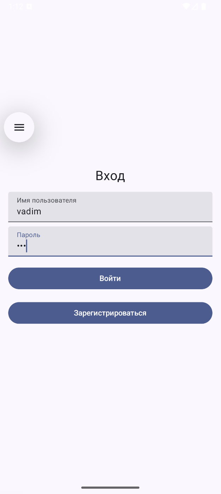
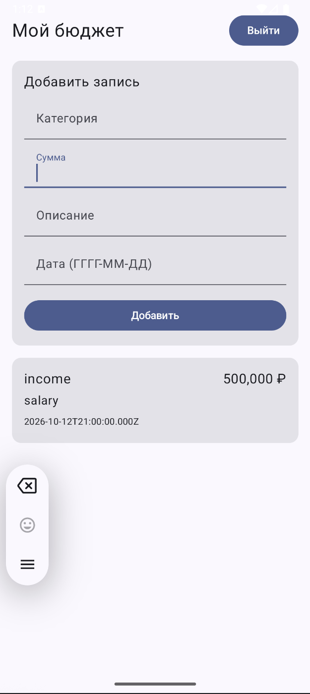

# Budget App - Personal Finance Manager

<div align="center">
  
    
</div>

## 💻 Technology Stack

### Backend
- **Node.js** (v18+)x
- **Express** - web framework
- **MySQL** - database
- **JWT** - authentication
- **XAMPP** - local server

### Android Client
- **Kotlin**
- **Jetpack Compose**
- **Retrofit**
- **DataStore**
- **ViewModel** + **Coroutines**

## 🛠️ Installation & Setup

### Backend Setup

```bash
# Clone repository
git clone https://github.com/your-username/budget-app.git
cd budget-app/server

# Install dependencies
npm init -y
npm install express body-parser mysql2 cors bcrypt jsonwebtoken

# Start server
node server.js
